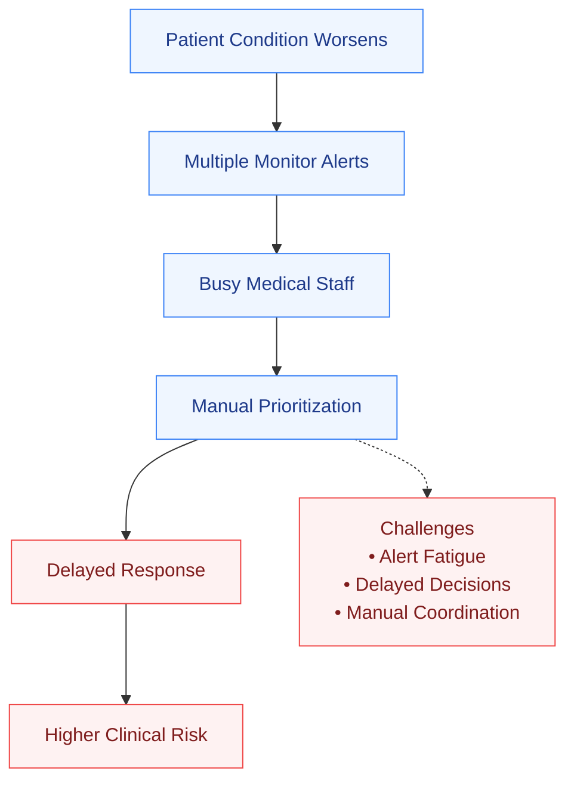
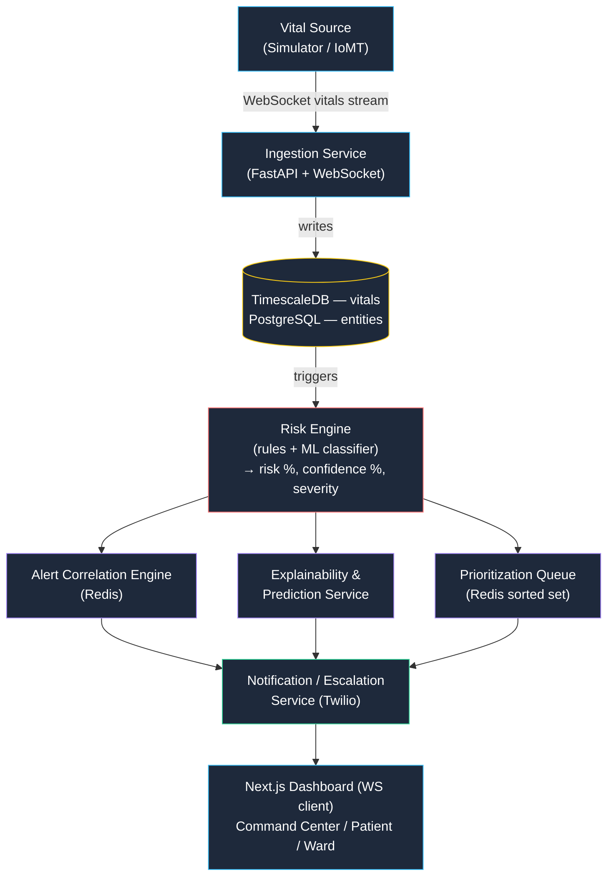

<div align="center">

# EaglesEye-AI

### AI-Powered Critical Patient Monitoring & Response Intelligence System

**Predict deterioration before it becomes critical. Explain every decision. Reach the right clinician in seconds.**

[]()
[]()
[]()
[]()
[]()
[]()
[]()
[]()
[]()

Built for **Rush Hour 2026** — National Level AI Innovation Hackathon

</div>

<br>

---

## Table of Contents

- [Overview](#-overview)
- [Key Features](#-key-features)
- [System Architecture](#-system-architecture)
- [AI Pipeline](#-ai-pipeline)
- [Technology Stack](#-technology-stack)
- [Screens](#-screens)
- [Repository Structure](#-repository-structure)
- [Quick Start](#-quick-start)
- [Usage](#-usage)
- [API Overview](#-api-overview)
- [Database Overview](#-database-overview)
- [AI Components](#-ai-components)
- [Performance & Real-Time Architecture](#-performance--real-time-architecture)
- [Security](#-security)
- [Testing](#-testing)
- [Roadmap](#-roadmap)
- [Engineering Challenges](#-engineering-challenges)
- [Future Enhancements](#-future-enhancements)
- [Contributing](#-contributing)
- [License](#-license)
- [Acknowledgements](#-acknowledgements)

---

## Overview

Hospital wards and ICUs generate a continuous stream of vital-sign data, but clinicians are still expected to catch deterioration by scanning charts and reacting to single-vital alarms — a process that's slow, noisy, and prone to **alarm fatigue**. A patient's heart rate, blood pressure, and SpO₂ can all drift in the same dangerous direction for several minutes before anyone connects the dots.

**EaglesEye-AI** is an AI-powered hospital command center that continuously monitors ICU/general-ward patients, predicts deterioration before it becomes critical, prioritizes clinical attention, correlates and de-duplicates alerts, explains every AI decision in plain language, and generates actionable, data-grounded clinical recommendations — all in real time.

### The Problem Today

Without an intelligence layer, a patient's decline still has to pass through every one of these manual steps before help arrives:



EaglesEye-AI replaces steps **B–E** with the automated [AI Pipeline](#-ai-pipeline) below — turning a chain of manual hand-offs into a sub-10-second, explainable, correlated escalation.

### Platform Pillars

| Pillar | Description |
|---|---|
| **Perception** | Continuous multi-parameter vital ingestion (HR, BP, SpO₂, Temp, RR) via a simulated sensor feed or WebSocket device stream |
| **Intelligence** | A hybrid risk-scoring engine (weighted clinical rules + gradient-boosted classifier) producing risk %, confidence %, and severity per patient on every vital tick |
| **Explainability** | Every risk score and alert ships with a ranked list of contributing factors and a plain-language reasoning trace — never a black box |
| **Correlation** | An alert-correlation layer that merges related abnormalities (e.g. ↑HR + ↓BP + ↓SpO₂) into a single named clinical concern (e.g. *"Possible Septic Shock"*) instead of three separate pings |
| **Response** | Twilio-powered voice call + SMS escalation to the assigned clinician, with a full auditable alert lifecycle (`Generated → Acknowledged → Viewed → Resolved/Escalated`) |

### Who It's For

- **Charge nurses** who need to know, at a glance, who needs attention right now.
- **Physicians on rounds** who need a one-paragraph AI triage summary instead of five charts.
- **Ward managers** who need occupancy, response-time, and risk-distribution analytics.
- **On-call engineers** who need proof the platform monitors its own operational health.

> [!IMPORTANT]
> **Non-negotiable system constraints:**
> - All AI outputs (risk score, summary, recommendation) are derived **only** from stored patient data — no fabricated clinical facts.
> - Every feature degrades gracefully if the AI/LLM service is unavailable, falling back to rule-based scoring and template summaries with an explicit **"AI Degraded"** banner.
> - All vitals and derived scores are versioned, time-stamped, and auditable via the Patient Timeline.
> - No duplicate alerts for the same underlying clinical event — the correlation engine is mandatory, not optional.

---

## Key Features

<table>
<tr><td width="50%" valign="top">

### Real-Time Patient Monitoring
- Live, per-patient vital card grid updated over WebSocket (target cadence 1–5s, no polling)
- Command Center Dashboard with ward-wide KPIs, active alert count, and a highest-risk patient spotlight
- "Signal Lost" badge on stale feeds (> 30s without an update)

### AI Risk Intelligence
- Hybrid **rules + gradient-boosted classifier** risk engine recomputing on every new vital reading
- Risk %, Confidence %, and Severity (`low`/`moderate`/`high`/`critical`) per patient
- Discrete abnormality classification: tachycardia, bradycardia, hypoxia, fever, hypotension, hypertension, and combined patterns
- Automatic fallback to pure rule-based scoring (`model_version: "rules-fallback"`) if the ML service is down

### Explainable AI
- Ranked contributing-factor breakdown behind every risk score
- Plain-language reasoning trace generated strictly from structured factors — no free-text hallucination
- Trend classification: `improving` / `stable` / `deteriorating` / `rapidly_deteriorating`
- Predictive **time-to-critical** estimate with an actual + projected trajectory chart

### Clinical Decision Support
- On-demand **AI Clinical Triage Assistant** generating condition, clinical concern, predicted outcome, key contributors, and recommended actions
- LLM output constrained to a strict JSON schema — grounded only in stored `RiskAssessment` / `ExplainabilityReport` data
- Deterministic template fallback (`degraded: true`) if the LLM is unavailable

</td><td width="50%" valign="top">

### Alert Correlation
- Sliding-window correlation engine merges ≥ 2 co-occurring abnormalities into one named clinical concern with a confidence score
- Full auditable alert lifecycle: `Generated → Acknowledged → Viewed → Resolved / Escalated`
- No duplicate `single_vital` alerts for the same abnormality within its active window

### Notification System
- Twilio Programmable Voice + SMS escalation to the assigned clinician
- Idempotent per simulation/incident run — never double-fires
- Filterable Notification Center (Unread / Critical / Resolved / Acknowledged) with a live unread-count badge
- Global fuzzy search across patients, rooms, wards, and alerts (< 300ms target for 500 patients)

### Analytics
- Interactive **Patient Analytics Workspace**: zoomable/pannable vital charts with AI annotations at abnormality timestamps
- **Multi-Patient Comparison** (2–4 patients side-by-side) with a synchronized time axis
- **Ward Analytics**: average risk, % critical, alert counts, response time, occupancy, and risk distribution

### Patient Prioritization
- Continuously ranked priority queue (Redis sorted-set, O(log n) updates) using a weighted composite of risk, trend, alert severity, and time-to-critical
- Rank-#1 patient highlighted consistently across every screen

### System Monitoring
- Live **System Health Dashboard**: API, AI service, WebSocket hub, sensor feed, database, Redis, model version, and queue depth
- Independent per-dependency probing — one failure never masks unrelated services

### Clinical Scenario Simulator
- Three demo-ready modes — **Stable**, **Gradual Decline**, **Severe Deterioration** — that drive the real ingestion → risk → correlation → prioritization → notification pipeline end-to-end without hardware

</td></tr>
</table>

---

## System Architecture

Vitals enter through the ingestion layer, are persisted to a time-series store, and trigger the Risk Engine. The Risk Engine's output fans out to three parallel consumers — Alert Correlation, Explainability & Prediction, and the Prioritization Queue — which converge on the Notification/Escalation service before reaching the clinician-facing dashboard.



---

## AI Pipeline

The end-to-end reasoning flow, from a single vital-sign reading to a phone ringing in a clinician's pocket:


> [!NOTE]
> Vital-to-dashboard latency target is **< 1s**; risk recompute **< 1s**; triage summary generation **< 4s**; end-to-end Twilio escalation call within **2–10s** depending on simulation mode.

---

## Technology Stack

### Frontend
| Layer | Choice |
|---|---|
| Framework | Next.js 14 (App Router) + TypeScript |
| Real-time client | Native WebSocket hooks (or `socket.io-client` if the backend hub uses Socket.IO) |
| Charts | Recharts — LineChart, AreaChart, BarChart, RadarChart |
| Styling | Tailwind CSS 3 + shadcn/ui components; dark/light theme via CSS variables |
| State | Zustand for global ward/patient selection state |
| Markdown | react-markdown for triage summary rendering |
| HTTP | Axios + SWR for cached REST calls (WebSocket handles live deltas) |

### Backend
| Layer | Choice |
|---|---|
| Runtime | Python 3.11 + FastAPI + Uvicorn |
| Real-time | Native FastAPI `WebSocket` + Redis pub/sub for multi-worker fanout |
| Background tasks | FastAPI `BackgroundTasks` / Celery (if queue depth grows) |

### AI / ML
| Layer | Choice |
|---|---|
| Risk classifier | scikit-learn / XGBoost gradient-boosted deterioration classifier + hand-authored clinical threshold rules |
| LLM | Groq API (LLaMA 3.1) or OpenAI, via a provider-agnostic `llm_client.py` wrapper |
| Explainability | SHAP-style feature attribution over the classifier, or weighted-rule contribution scoring for the rules-fallback path |

### Database
| Layer | Choice |
|---|---|
| Time-series | TimescaleDB (PostgreSQL extension) — vitals |
| Relational | PostgreSQL — patients, alerts, users, and other entities |
| Search | PostgreSQL `pg_trgm` (or equivalent) for global fuzzy search |

### Real-Time Communication
| Layer | Choice |
|---|---|
| Live push | WebSockets — per-patient vitals, dashboard, alerts, and system health hubs |
| Cache / Queue | Redis 7 — hot patient cache, priority sorted-set, alert correlation windows |

### Notifications
| Layer | Choice |
|---|---|
| Escalation | Twilio Programmable Voice (TwiML) + SMS |

### Infrastructure / DevOps
| Layer | Choice |
|---|---|
| Containers | Docker Compose — backend + frontend + Postgres/TimescaleDB + Redis |
| Config | `.env`-driven — LLM provider/model, Twilio credentials, DB URLs — never hardcoded |
| Deployment | `docker-compose up` for local/demo; services designed to scale horizontally for production |

---

## Screens

| Route | Screen | Screenshot |
|---|---|---|
| `/` | Command Center Dashboard | `docs/screenshots/command-center.png` |
| `/patients/{id}` | Patient Analytics Workspace | `docs/screenshots/patient-workspace.png` |
| `/alerts` | Alert Management | `docs/screenshots/alerts.png` |
| `/compare` | Multi-Patient Comparison | `docs/screenshots/compare.png` |
| `/ward/{id}/analytics` | Ward Analytics | `docs/screenshots/ward-analytics.png` |
| `/notifications` | Notification Center | `docs/screenshots/notifications.png` |
| `/simulator` | Clinical Scenario Simulator | `docs/screenshots/simulator.png` |
| `/system-health` | System Health Dashboard | `docs/screenshots/system-health.png` |

*(Add real screenshots/GIFs to `docs/screenshots/` and update the paths above.)*

---

## Repository Structure

```
eagleseye-ai/
├── app/
│   ├── api/                      # FastAPI routers — one per feature domain
│   │   ├── dashboard.py
│   │   ├── vitals.py
│   │   ├── risk.py
│   │   ├── explainability.py
│   │   ├── triage.py
│   │   ├── alerts.py
│   │   ├── priority.py
│   │   ├── patients.py
│   │   ├── comparison.py
│   │   ├── ward.py
│   │   ├── notifications.py
│   │   ├── search.py
│   │   ├── simulator.py
│   │   └── system.py
│   ├── ai/                       # Risk, explainability, and triage intelligence
│   │   ├── risk_engine.py
│   │   ├── rules/clinical_thresholds.py
│   │   ├── models/deterioration_classifier.py
│   │   ├── abnormality_detector.py
│   │   ├── explainability.py
│   │   ├── predictor.py
│   │   ├── triage_assistant.py
│   │   ├── triage_fallback.py
│   │   └── alert_correlation.py
│   ├── services/                 # Aggregation, lifecycle, and analytics logic
│   │   ├── dashboard_aggregator.py
│   │   ├── patient_cache.py
│   │   ├── vital_validator.py
│   │   ├── alert_lifecycle.py
│   │   ├── priority_engine.py
│   │   ├── timeline_service.py
│   │   ├── ward_analytics.py
│   │   ├── notification_service.py
│   │   └── health_monitor.py
│   ├── ws/                       # WebSocket hubs
│   │   ├── dashboard_hub.py
│   │   ├── vitals_hub.py
│   │   ├── alerts_hub.py
│   │   └── health_hub.py
│   ├── db/                       # Persistence layer
│   │   └── timescale_vitals.py
│   ├── integrations/              # External service clients
│   │   ├── llm_client.py
│   │   └── twilio_client.py
│   └── simulator/                 # Clinical Scenario Simulator engine
│       ├── engine.py
│       └── runner.py
├── frontend/                      # Next.js 14 application
│   ├── app/                       # App Router routes (/, /patients/[id], /alerts, /compare, ...)
│   ├── components/                # Shared UI (risk badges, charts, alert cards)
│   └── lib/                       # WebSocket hooks, API client, Zustand stores
├── docker-compose.yml
├── .env.example
└── README.md
```

---

## Quick Start

### Requirements
- Python 3.11+
- Node.js (for Next.js 14 / TypeScript frontend)
- PostgreSQL with the TimescaleDB extension
- Redis 7
- Docker & Docker Compose (recommended for local setup)
- Twilio account (Voice + SMS)
- Groq or OpenAI API key

### 1. Clone
```bash
git clone https://github.com/<your-org>/eagleseye-ai.git
cd eagleseye-ai
```

### 2. Configure environment variables
```bash
cp .env.example .env
# then fill in DB URLs, Redis URL, LLM provider/model, and Twilio credentials
```

EaglesEye-AI is fully `.env`-driven — LLM provider/model, Twilio credentials, and database URLs are never hardcoded.

| Category | Description | Required |
|---|---|---|
| Database connection | PostgreSQL / TimescaleDB connection URL | |
| Redis connection | Redis URL for pub/sub, caching, and the priority sorted-set | |
| LLM provider | Groq or OpenAI, selected via the provider-agnostic `llm_client.py` wrapper | |
| LLM model | Model name/version used for triage summary generation | |
| LLM API key | Credential for the selected LLM provider | |
| Twilio credentials | Account SID, auth token, and sender number for Voice/SMS escalation | |

> [!NOTE]
> Exact variable names should match your `.env.example` / deployment config — the PRD specifies these as configuration *categories*, not literal key names.

### 3. Provision the database
```bash
# Provision PostgreSQL + TimescaleDB (via Docker Compose, see below, or a managed instance)
# Run migrations for entities (patients, alerts, users) and TimescaleDB hypertables (vitals)
```

### 4. Run the backend
```bash
cd app
python -m venv .venv && source .venv/bin/activate
pip install -r requirements.txt
uvicorn main:app --reload
```

### 5. Run the frontend
```bash
cd frontend
npm install
npm run dev
```

### Or, run everything with Docker
```bash
docker-compose up
```
Backend, frontend, PostgreSQL/TimescaleDB, and Redis all start together for local demo use; each service is designed to scale independently in production.

---

## Usage

The Clinical Scenario Simulator is the primary way to exercise the entire platform without physical monitoring hardware, driving the real ingestion pipeline end-to-end:

1. Open the **Command Center Dashboard** (`/`) — a quiet, mostly-stable ward with live KPI counts.
2. Go to `/simulator`, select a patient, and run **Gradual Decline** or **Severe Deterioration**.
3. Every generated reading is written through the real `POST /api/patients/{id}/vitals` ingestion endpoint — no shortcut writes.
4. Watch the **Risk Engine** recompute risk/confidence/severity, the **Explainability panel** update with ranked contributing factors, and the **trend** flip toward `deteriorating`.
5. The **Alert Correlation Engine** merges co-occurring abnormalities into a single named alert (e.g. *"Possible Septic Shock"*).
6. The patient climbs the **Priority Queue**, and the **Notification/Escalation service** fires a Twilio voice call + SMS to the assigned clinician.
7. Open the **AI Clinical Triage Assistant** on the patient's page to generate a grounded summary with recommended actions.
8. Explore `/compare` for side-by-side patient comparison and `/system-health` for live operational status.

---

## API Overview

<details>
<summary><strong>Click to expand the full endpoint reference</strong></summary>

| Endpoint | Purpose |
|---|---|
| `GET /api/dashboard/summary` | Ward-level KPI summary |
| `GET /api/dashboard/patients` | Sorted live patient list |
| `WS /api/dashboard` *(`/ws/dashboard`)* | Live dashboard push |
| `POST /api/patients/{id}/vitals` | Vital ingestion (device/simulator) |
| `GET /api/patients/{id}/vitals/latest` | Latest vital reading |
| `WS /ws/patients/{id}/vitals` | Live per-patient vital stream |
| `GET /api/patients/{id}/risk/current` | Current risk assessment |
| `GET /api/patients/{id}/risk/history` | Risk score history |
| `GET /api/patients/{id}/explainability` | Contributing-factor breakdown |
| `GET /api/patients/{id}/prediction` | Deterioration prediction |
| `POST /api/patients/{id}/triage` | Generate AI clinical summary |
| `GET /api/alerts` | List alerts |
| `POST /api/alerts/{id}/acknowledge` \| `/resolve` \| `/escalate` | Alert lifecycle transitions |
| `WS /ws/alerts` | Live alert stream |
| `GET /api/priority/queue` | Ranked priority queue |
| `GET /api/patients/{id}` | Full patient profile |
| `GET /api/patients/{id}/vitals/history` | Historical vitals for charting |
| `GET /api/patients/{id}/timeline` | Chronological event log |
| `GET /api/patients/compare` | Multi-patient comparison |
| `GET /api/ward/{id}/analytics` | Ward-level analytics |
| `GET /api/notifications` | Notification feed |
| `GET /api/search` | Global search |
| `POST /api/simulator/start` \| `/stop` | Clinical scenario simulator control |
| `GET /api/system/health` | Operational health status |

</details>

---

## Database Overview

EaglesEye-AI splits storage between **PostgreSQL** (relational entities) and **TimescaleDB** (time-series vitals), with **Redis** handling hot-path caching and the priority sorted-set.

| Entity | Storage | Description |
|---|---|---|
| `VitalReading` | TimescaleDB | Per-tick HR, BP, SpO₂, temperature, RR — full resolution, never overwritten |
| `PatientProfile` | PostgreSQL | Patient identity, room/bed, current vitals, risk, prediction, latest triage, active alerts |
| `RiskAssessment` | PostgreSQL / cache | Risk score, confidence, severity, detected abnormalities, model version |
| `ExplainabilityReport` | PostgreSQL / cache | Ranked contributing factors + reasoning trace |
| `DeteriorationPrediction` | PostgreSQL / cache | Likelihood %, time-to-critical, risk trajectory, trend |
| `TriageSummary` | PostgreSQL | Condition, clinical concern, predicted outcome, contributors, recommended actions |
| `AlertEvent` | PostgreSQL + Redis | Correlated/single-vital alerts with full `status_history` |
| `PriorityEntry` | Redis sorted set | Live-ranked patient urgency queue |
| `TimelineEvent` | PostgreSQL | Chronological, auditable log of every vital/alert/prediction/triage/doctor action |
| `Notification` | PostgreSQL | Alert/escalation/triage/system notifications |
| `SimulationRun` / `EscalationCall` | PostgreSQL | Simulator run metadata and Twilio call/SMS delivery status |

Shared conventions: string/UUID identifiers, ISO 8601 UTC timestamps, `0–100` float risk/confidence scores, and consistent `low`/`moderate`/`high`/`critical` severity tiers across every feature.

---

## AI Components

| Component | What It Does |
|---|---|
| **Risk Engine** | Orchestrates a **rules pass** (age-banded clinical thresholds) and an **ML pass** (gradient-boosted classifier) into a single blended risk score, confidence, and severity — recomputed within 1s of every new vital reading |
| **Abnormality Detection** | Classifies single-vital abnormalities (tachycardia, bradycardia, hypoxia, fever, hypotension, hypertension) and **combined patterns**, which fire only when ≥ 2 correlated vitals cross threshold simultaneously |
| **Explainability** | Produces a ranked, weight-sorted list of contributing factors and a reasoning sentence generated strictly from those factors — SHAP-style attribution over the classifier, or weighted-rule scoring on the fallback path |
| **Prediction Engine** | Extrapolates the recent risk trajectory (linear/exponential) to estimate time-to-critical; returns `null` whenever the trend is `stable` or `improving` |
| **Clinical Triage Assistant** | Injects only structured patient data (vitals, risk, explainability, abnormalities) into an LLM system prompt constrained to a strict JSON output schema — zero free-narrative generation, zero hallucinated clinical facts |
| **Alert Correlation Engine** | A Redis-backed sliding-window rules engine that maps co-occurring abnormality combinations to a single named clinical concern with a confidence score, preventing duplicate single-vital alerts for the same event |
| **Priority Engine** | A weighted composite of risk score, trend direction, active alert severity, and time-to-critical, written to a Redis sorted-set for O(log n) live re-ranking |
| **Clinical Scenario Simulator** | An async engine generating parametrized (not random) vital time-series for **Stable**, **Gradual Decline**, and **Severe Deterioration** modes — every tick flows through the real ingestion API, driving the full pipeline end-to-end |

### Risk Score Formula
```
risk_score = clamp(
    Σ (abnormality_weight_i × severity_multiplier_i) for each detected abnormality
  + trend_adjustment(recent_slope)
  + correlation_bonus(if combined abnormality pattern matched),
  0, 100
)
confidence = f(reading_count_in_window, signal_variance, model_agreement_between_rules_and_ML)
```

---

## Performance & Real-Time Architecture

- **WebSockets** — FastAPI-native `WebSocket` connections power per-patient vitals, the dashboard, alerts, and system health, each with a dedicated connection-manager hub.
- **Redis** — pub/sub for multi-worker WebSocket fanout, hot patient-state caching, the correlation engine's sliding-window state, and the priority sorted-set.
- **TimescaleDB** — full-resolution vital storage as a PostgreSQL hypertable, with downsampled/range-queried aggregation for long historical charts.
- **Caching** — Redis-backed hot cache of the latest `PatientSummary` per patient keeps dashboard aggregation fast at scale.
- **Scalability** — ward is a first-class dimension on every entity/query; the Redis-backed priority queue and TimescaleDB hypertables are designed for horizontal, multi-ward scale.

> [!NOTE]
> Latency targets: vital-to-dashboard **< 1s**, risk recompute **< 1s**, triage summary generation **< 4s**, end-to-end Twilio escalation **2–10s**.

---

## Security

- **Authentication / Authorization** — clinician actions (acknowledge, resolve, escalate) are attributed to a `by_user` on every `AlertStatusEvent`, forming a full auditable lifecycle log.
- **Input Validation** — vital readings are schema- and physiological-range checked on ingestion; out-of-range values are flagged, never silently clamped or hidden.
- **Secrets Management** — LLM provider/model, Twilio credentials, and database URLs are entirely `.env`-driven and never hardcoded.
- **AI Safety & Hallucination Prevention**:
  - Every AI output is derived only from stored patient data.
  - The Clinical Triage Assistant's LLM is constrained to a strict JSON output schema — never free-narrative generation.
  - `reasoning` and `clinical_concern` text is generated only from structured `top_factors` / `RiskAssessment` fields.
  - If the AI/LLM service is unavailable, the platform automatically falls back to rule-based scoring and deterministic template summaries, surfaced via a visible **"AI Degraded"** banner — patient monitoring never stops.

---

## Testing

| Layer | Focus |
|---|---|
| **Unit Tests** | Risk formula, abnormality thresholds, correlation window logic, priority scoring |
| **Integration Tests** | Vital ingestion → risk recompute → alert generation → notification pipeline |
| **API Tests** | Full REST endpoint contract coverage (dashboard, patients, alerts, priority, triage, simulator) |
| **WebSocket Tests** | Per-patient, dashboard, alert, and health hub broadcast correctness and latency |
| **AI Validation** | Confirming triage/explainability output stays grounded in structured data (no hallucinated fields), and that AI-degraded fallback paths trigger correctly |

> [!TIP]
> Acceptance criteria throughout the PRD are explicitly tagged `TESTABLE` (automatable) or `DEMO` (visual/manual verification), giving a direct mapping from spec to test suite.

---

## Roadmap

Adapted from the PRD's phased execution plan for a two-team parallel build.

**Completed / Spec-Frozen**
- [x] Feature specification, API contracts, and data models for all 12 modules
- [x] System architecture and AI pipeline design
- [x] Team split and phase plan (Team Alpha: AI/Backend, Team Beta: Frontend/Integration)

**In Progress**
- [ ] Phase 1 — Vitals ingestion + WebSocket, Dashboard skeleton
- [ ] Phase 2 — Risk Engine, Explainability + Prediction
- [ ] Phase 3 — Alert correlation, Priority queue
- [ ] Phase 4 — Triage Assistant, Clinical Scenario Simulator + Twilio

**Future**
- [ ] Phase 5 — Patient Analytics Workspace, Comparison & Ward Analytics
- [ ] Phase 6 — Notifications/Search, System Health Dashboard, UI polish
- [ ] Demo rehearsal against the 8-minute judging script

---

## Engineering Challenges

| Challenge | Solution |
|---|---|
| **Alarm fatigue vs. sensitivity** | A mandatory alert-correlation layer requires ≥ 2 co-occurring abnormalities within a 5-minute window before merging into a single named `correlated` alert, so single-vital noise never triggers a Twilio escalation directly. |
| **Explainability without hallucination** | Every reasoning sentence, clinical concern, and recommended action is built strictly from structured `RiskAssessment` / `ExplainabilityReport` fields, with the LLM constrained to a JSON schema instead of free narrative generation. |
| **Graceful AI degradation** | Every AI-dependent feature (risk scoring, triage) has a deterministic, non-LLM fallback path so patient monitoring never stops if the AI/LLM service goes down. |
| **Real-time consistency at scale** | A Redis-backed priority sorted-set and TimescaleDB hypertables keep sub-second risk recompute and O(log n) priority updates feasible as patient/ward count grows. |
| **Auditable state, not just live state** | Every alert status transition is appended (never overwritten) to `status_history`, and every clinical event is logged to the per-patient Timeline. |

---

## Future Enhancements

- Horizontal scaling of ingestion, risk, and notification services beyond a single ward.
- Expansion of the deterioration classifier and clinical threshold rules as more labeled data becomes available.
- Additional Clinical Scenario Simulator modes beyond Stable / Gradual Decline / Severe Deterioration.

---

## Contributing

Contributions are welcome. Please:

1. Fork the repository and create a feature branch.
2. Keep changes scoped to a single feature module (see [Repository Structure](#-repository-structure)).
3. Ensure new backend logic includes corresponding unit/integration tests.
4. Open a pull request describing the change and which acceptance criteria it addresses.

---

## License

Distributed under the **MIT License**. See `LICENSE` for details.

---

## Acknowledgements

- *Rush Hour 2026**
- Built around FastAPI, Next.js, TimescaleDB, Redis, and Twilio
